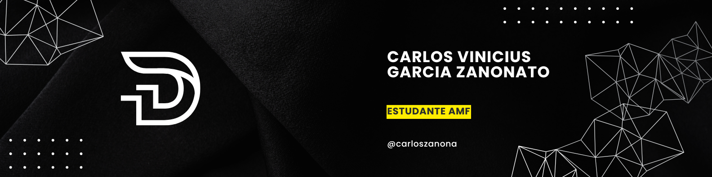

<!--Banner-->

<!--Night Owl image-->

  

<!--Header Name-->
#  Vinicius Zanonato! 
*Estudante de SI (Aspirante a Programador)*
  

<!--Start Intro-->               

Eu sou um Estudante de Sistemas de Informação e Entusiasta de Programação/Robótica. 

- ✨ Estudante da Vida :)
- 🌱 Estou atualmente aprendendo muitas coisas, creio que cada dia é uma oportunidade de aprendizado.
- ✍ Estudante da Antonio Meneghetti Faculdade [faculdade] (https://www2.faculdadeam.edu.br/).
- ❤ Contruibuindo para o Open Source.
<!--End Intro-->

<!--Profile Count Badge

 

-->

---

<!--Languages and Tools Section-->       
<h2 align="center">𝙏𝙚𝙘𝙣𝙤𝙡𝙤𝙜𝙞𝙖 𝙚 𝘾𝙤𝙣𝙝𝙚𝙘𝙞𝙢𝙚𝙣𝙩𝙤</h2> 
<picture>
  <source media="(prefers-color-scheme: dark)" srcset="./Skills_Animation_Dark.gif">
  <source media="(prefers-color-scheme: light)" srcset="./Skills_Animation_White.gif">
  
</picture>
 

<h3 align="center">Atualmente Aprendendo</h3>
<ul align="left">
  <li>Iniciado em Python.</li>
  <li>Aprofundando meu conhecimento de Programação e IA desde o começo com a Faculdade.</li>
  <li>Melhorando minhas habilidades de Computação/TI na AMF</li>
  <li>Buscando Aprender um pouco de tudo no ramo da Ciencia e Tecnlogoia</li>
  <li>Rumo a um Futuro melhor, tanto como pessoa quanto profissional.</li>
 
 
 
 

<!--Github stats Table--> 
<h2 align="center">📊 Status do Github 📊</h2>

<table width="100%">
  <tr>
    <td width="50%">
      <h3 align="center"><strong>Gɪᴛʜᴜʙ Sᴛᴀᴛs</strong></h3>
      

        
      

    </td>
    <td width="50%">
      <h3 align="center"><strong>Sᴛʀᴇᴀᴋ Sᴛᴀᴛs</strong></h3>
      

        
      

    </td>
  </tr>
  <tr>
    <td width="50%">
      <h3 align="center"><strong>Ultimos Projetos</strong></h3>
      

        
      

    </td>
    <td width="50%">
      <h3 align="center"><strong>Contruibuidores</strong></h3>
      

        
      

    </td>
  </tr>
</table>
 

<!--Contribution Graph-->
<h2 align="center">📈 Grafico de Contribuição 📈</h2>

    

---

<!--Contact Section--> 

<h2 align="center">🤝 Me Contate 🤝 </h2>

  

 

<!--Footer--> 

  

